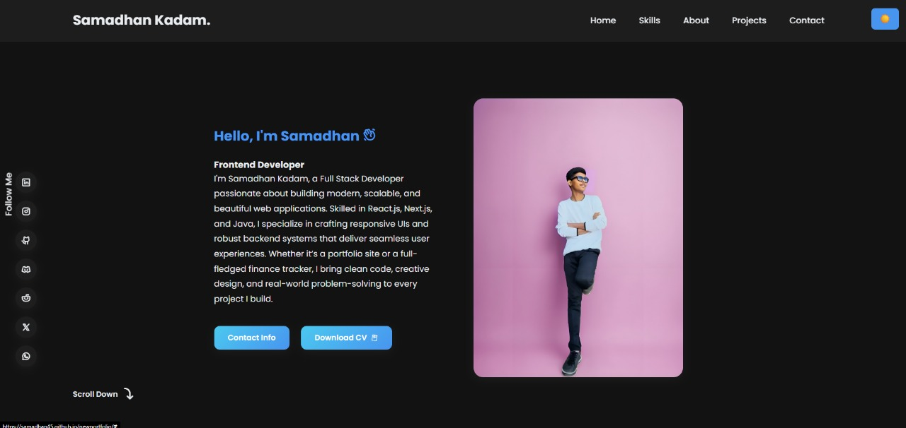

# 👨‍💻 Samadhan Kadam - Portfolio

## 👋 Hello, I'm Samadhan Kadam

🎯 A passionate **Full Stack Developer** focused on building modern, scalable, and beautiful web applications.

💡 Skilled in **React.js**, **Next.js**, and **Java**, I craft responsive user interfaces and robust backend systems that deliver seamless user experiences.

📁 Whether it's a personal portfolio or a finance tracker, I bring clean code, creative design, and real-world problem-solving to every project I build.

---

## 🚀 Technologies Used

- HTML5
- CSS3
- JavaScript
- React.js
- Responsive Design

---

## 🔗 Links

- 🔗 **Live Portfolio**: [https://samadhan45.github.io/newportfolio/](https://samadhan45.github.io/newportfolio/)
- 💼 **LinkedIn**: [linkedin.com/in/samadhan1](https://www.linkedin.com/in/samadhan1)
- 💻 **GitHub**: [github.com/Samadhan45](https://github.com/Samadhan45)
- 📧 **Email**: samadhankadam002@gmail.com

---

## 📸 Preview

---

## 🙌 Let's Connect!

If you like my work or want to collaborate, feel free to reach out via LinkedIn or email. Thank you for visiting!

**— SAMADHAN VILAS KADAM**
